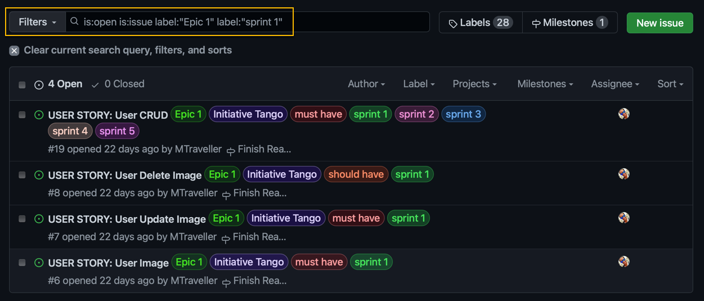
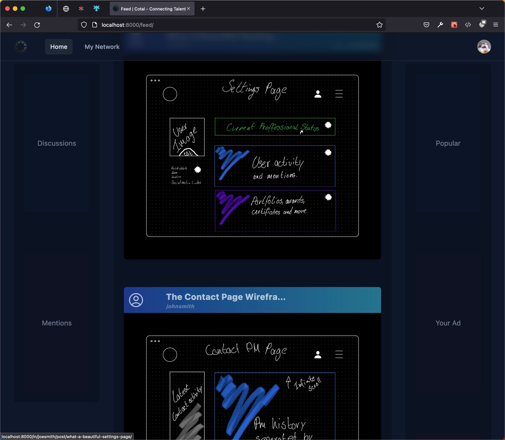
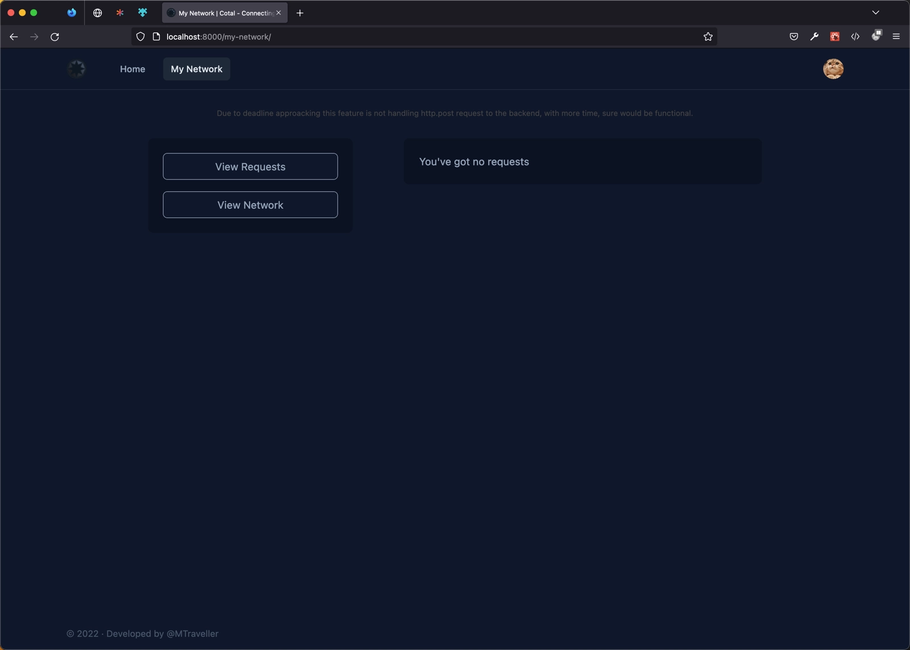
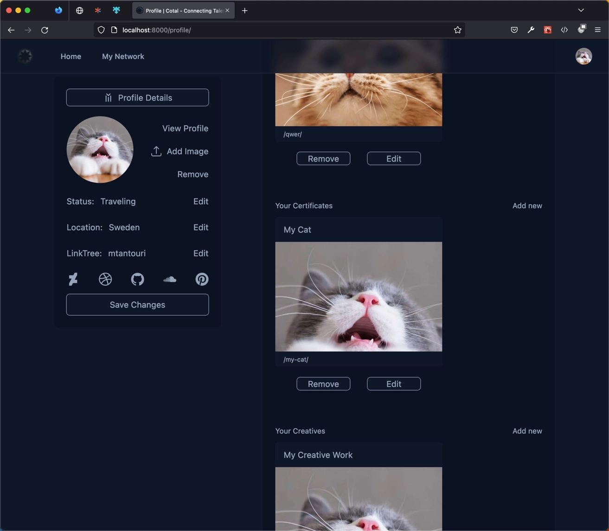
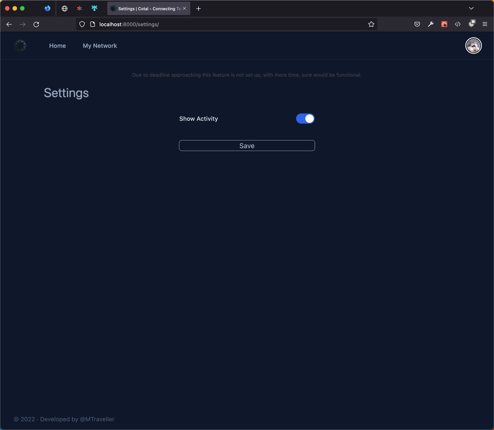
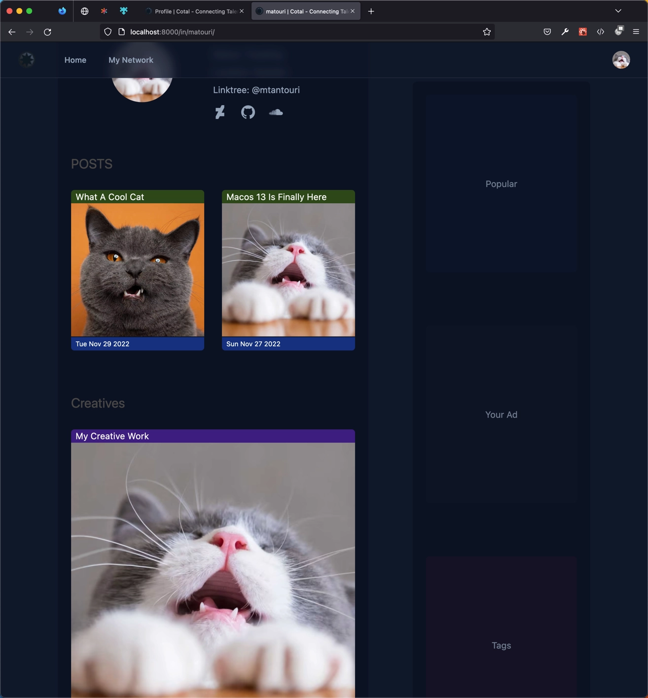
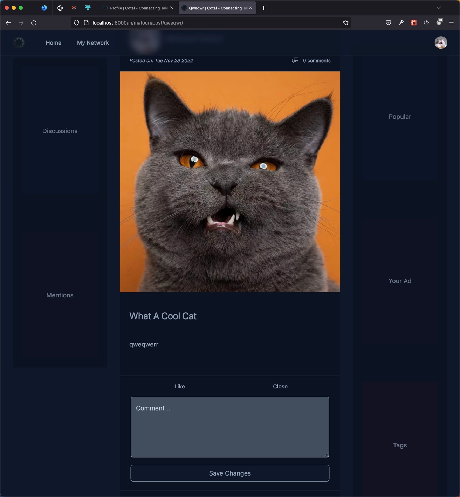
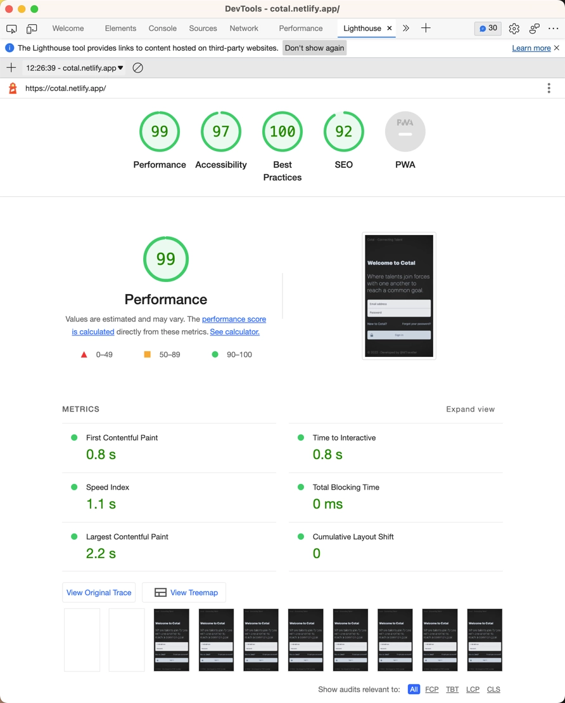

# The 5th Project Portfolio of CI

## Cotal

Frontend Project URL: [View live project](https://cotal.netlify.app 'Cotal')

Backend Project URL: [View live project](https://cotal-api.onrender.com 'Cotal-DRF')

Backend Project REPO: [View live project](https://github.com/MTraveller/cotal-drf 'Cotal-DRF')

 

 

## User stories

User stories were created at the beginning of the project before any actual coding began.

See completed and not completed user stories + testing of user stories [here](./user-stories.md 'User Stories')

    

## Table of Contents

- [Planes](#planes)
  - [The Surface](#surface)
  - [Skeleton](#skeleton)
  - [Structure](#structure)
  - [Scope](#scope)
  - [Strategy](#strategy)
- [Development](#development)
  - [HTML](#dev-html)
  - [CSS](#dev-css)
  - [Python](#dev-python)
  - [Testings](#testings)
  - [Bugs](#bugs)
- [Validator](#validator)
- [Deployment](#deployment)
  - [Fork](#fork)
  - [Clone](#clone)
  - [Deploy](#deploy)
- [Credits](#credits)

 

## Planes

 

### Surface

The colors used for this project are the following: some light blue, pink, yellow, and lime green are also used.

The logo and loader were made by myself, and post images shown in this readme, were taken from rotating backgrounds on my Samsung phone.

 

Feed page

 

Network page

 

Account page

 

Setting page

 

Profile page

 

Post page

 

#### Wireframe

|                         Mobile                         |                       Desktop                       |
| :----------------------------------------------------: | :-------------------------------------------------: |
| Not Done, but is fully responsive throughout the site. | see wireframes [here](./wireframes.md 'wireframes') |

 

- #### Colour Scheme

  - 

    

   

  #### Typography

  - System font is used to save resources and user is already familiar with the font used on system.

   

- #### Imagery

  - The purpose of the images is to make the app more appealing.
  - The colors and images all serve to be aligned with and assist in the app's branding.
  - The images also intend to give the app an identity the user can relate to, lifting its overall impression.

   

  - Favicon image:

    

   

### Skeleton

On top, there's the header; in the middle, the main content area; and at the bottom, the footer. The content is centered with two sidebars that can show related information to the user. The navigation is sticky and will follow the user while scrolling on both mobile and desktop.

 

### Structure

Data is structured around the user, the user is the main focus.

 

### Scope

What features,(nvp), both ability and desires?

#### Minimum viable product

can add content 
can add images 
can comment 

#### Desired features

messaging 
networking 
following 
post likes 
comment edit 
comment delete 
search posts 

 

### Strategy

The site's goal is to bring young people together and encourage them to work together to create jobs for themselves. Together, they can begin an adventurous journey.

 

## Development

#### Component Reuse

Throughout the development of Cotal, the concept of reusing components was of high importance, and while it is clearly evident that components were reused in this project, it was not appreciated. This section is to document some of the reused components.

|                         Component                      |                       Explanation                   |
| :----------------------------------------------------: | :-------------------------------------------------: |
| [Input.jsx](./src/components/form/input/Input.jsx) | Allowing to use one `<input />` for all inputs. |
| [checkEquality.js](./src/utils/checkEquality.js) | To check input values against database values and detect changes. |
| [httpService.js](./src/services/httpService.js) | To allow communication bwtween frontend and backend. |
| [authService.js](./src/services/authService.js) | To allow loggin in/loggin out, storing user token and more. |
| [userData.js](./src/services/userData.js) | To get the current user information from database. |
| [UserPost.jsx](./src/components/page/UserPost.jsx) | To display a user post, portfolio, award, certificate and creative. |
| [SideBarLeft.jsx](./src/components/page/side-bar/three-section/SideBarLeft.jsx) | To display left sidebar on different page for three section page layout. |
| [SideBarRight.jsx](./src/components/page/side-bar/three-section/SideBarRight.jsx) | To display left sidebar on different page for three section page layout. |
| [SideBar.jsx](./src/components/page/side-bar/two-section/SideBar.jsx) | To display left/right sidebar on different page for two section page layout. |
| [OneSection.jsx](./src/components/layout/template/public-route/OneSection.jsx) | To display a one section page layout. For not logged in users. |
| [OneSection.jsx](./src/components/layout/template/private-route/OneSection.jsx) | To display a one section page layout. For logged in users. |
| [TwoSectionLeft.jsx](./src/components/layout/template/private-route/TwoSectionLeft.jsx) | To display a two section page layout with left sidebar. |
| [TwoSectionRight.jsx](./src/components/layout/template/private-route/TwoSectionRight.jsx) | To display a two section page layout with right sidebar. |
| [ThreeSection.jsx](./src/components/layout/template/private-route/ThreeSection.jsx) | To display a three section page layout with left and right sidebars. |
| [LoggedInContext.jsx](./src/context/LoggedInContext.jsx) | To allow easy check if visitor is logged in |
| [UserDataContext.jsx](./src/context/UserDataContext.jsx) | To allow easy access no matter component depth of userData |
| [Seo.jsx](./src/components/Seo.jsx) | To inject meta tags to `<head>` |
| [InputEditButton.jsx](./src/components/form/InputEditButton.jsx) | To allow to swap between span and input in PersonalDetail.jsx |
| [FlipTwo.jsx](./src/components/form/input/FlipTwo.jsx) | To allow to swap between social icons and input in PersonalDetail.jsx |
| [Textarea.jsx](./src/components/form/input/Textarea.jsx) | To use one `<textarea>` input on multiple components. |
| [UploadSvg.jsx](./src/components/form/input/UploadSvg.jsx) | To use a unified upload icon on multiple places but with different width and height. |
| [SocialInput.jsx](./src/components/form/input/profile/SocialInput.jsx) | To allow one component to be reused for different social icons. |

#### Languages Used

- [HTML](https://en.wikipedia.org/wiki/HTML "Wikipedia's HTML page")
- [CSS3](https://en.wikipedia.org/wiki/Cascading_Style_Sheets "Wikipedia's CSS3 page")
- [JavaScript](https://en.wikipedia.org/wiki/JavaScript "Wikipedia's JavaScript page")
- [JSX](https://en.wikipedia.org/wiki/JSX_(JavaScript) "Wikipedia's JSX page")

 

### Frameworks, Libraries & Programs Used

 

1. [Mockup - Sketch UI & UX](https://apps.apple.com/us/app/mockup-sketch-ui-ux/id1527554407 'apps.apple.com')
- Mockup takes a fresh approach by redefining and upgrading novel concepts when it comes to UI & UX sketching. With the creative experience and intuitive touch it offers, it is the perfect app to brainstorm and blueprint your next app design.

2. [Git](https://git-scm.com/ 'git-scm.com')
- Git was used for version control by utilizing the Gitpod terminal to commit to Git and Push to GitHub.

3. [GitHub:](https://github.com/ 'github.com')
- GitHub is used to store the project's code after being pushed from Git.

4. [Netlify](https://www.netlify.com 'netlify.com')
- The fastest way to combine your favorite tools and APIs to build the fastest sites, stores, and apps for the web.

6. [VisualStudioCode](https://code.visualstudio.com 'code.visualstudio.com')
- Visual Studio Code is a code editor redefined and optimized for building and debugging modern web and cloud applications.

7. [tailwindcss](https://tailwindcss.com/ 'tailwindcss.com')
- A utility-first CSS framework packed with classes like flex, pt-4, text-center and rotate-90 that can be composed to build any design, directly in your markup.

8. [styled components](https://styled-components.com/ 'styled-components.com')
- Visual primitives for the component age. Use the best bits of ES6 and CSS to style your apps without stress 

9. [Affinity designer](https://code.visualstudio.com 'https://code.visualstudio.com')
- Professional photo editing, publishing, graphic design and illustration at your fingertips.

10. [yarn](https://yarnpkg.com/ 'yarnpkg.com')
- Yarn is a package manager that doubles down as project manager. Whether you work on one-shot projects or large monorepos, as a hobbyist or an enterprise user, we've got you covered.

11. [gatsby](https://www.gatsbyjs.com/ 'gatsbyjs.com')
- Gatsby enables developers to build fast, secure, and powerful websites using a React-based framework and innovative data layer that makes integrating different content, APIs, and services into one web experience incredibly simple.

12. [axios](https://axios-http.com/ 'axios-http.com')
- Axios is a simple promise based HTTP client for the browser and node.js. Axios provides a simple to use library in a small package with a very extensible interface.

13. [react icons](https://react-icons.github.io/react-icons 'react-icons.github.io')
- nclude popular icons in your React projects easily with react-icons, which utilizes ES6 imports that allows you to include only the icons that your project is using.

14. [dotenv](https://www.npmjs.com/package/dotenv 'npmjs.com')
- Dotenv is a zero-dependency module that loads environment variables from a .env file into process.env. Storing configuration in the environment separate from code is based on The Twelve-Factor App methodology.

15. [prettier](https://prettier.io/ 'prettier.io')
- code formatter
   
16. [eslint](https://eslint.org/ 'eslint.org')
-  ESLint statically analyzes your code to quickly find problems. It is built into most text editors and you can run ESLint as part of your continuous integration pipeline.

## Testings

### Lighthouse

 

### User Stories

Testings of [user stories](./user-stories.md)

### Bugs

I have grown fond of eliminating bugs found in my code as I intentionally try to provoke and find them. All known bug were fixed.

 

## Validator

JS validator through VSCode, eslint.

 

## Deployment

 

### Fork

How to fork this repository:

1. Log in to GitHub and navigate to [this repository](https://github.com/MTraveller/cotal).
2. You'll see a button called <b>Fork</b> on the top right side of the page. Click the button to create a copy of this repository to your own GitHub account.

 

### Clone

How to clone this project:

1. Under the repository’s name, click on the <b>Code</b> button.
2. In the <b>HTTPS</b> tap, click on the clipboard icon to copy the given URL.
3. In your IDE of choice, open <b>**git bash**</b>.
4. Change the current working directory to where you want the cloned directory to be.
5. Type <b>**git clone**</b>, paste the URL copied from GitHub - https://github.com/MTraveller/cotal.git.
6. Press <b>**enter**</b>, and you are done.

 

### Development

Download the repo and install yarn. Then write yarn install and yarn will install all dependencies. There after you can do one of the following.

First install [gatsby-cli](https://www.gatsbyjs.com/docs/reference/gatsby-cli/ "gatsbyjs.com/docs")

yarn start to start the development 
yarn build to build an optimized version 
yarn serve to serve as production. 

the env.development and env.production needs edit.

### Deploy

To deploy to netlify, simply sign up to netlify and connect your account. Adding and connecting netlify with your repo will automatically deploy this project on netlify.

Remember to add GATSBY_API_URL [environment variable](https://docs.netlify.com/environment-variables/overview/ "docs.netlify.com") to the backend api url.

 

## Credits

 

### Sources Used

[React Docs](https://reactjs.org 'react') 
[Gatsby Docs](https://www.gatsbyjs.com/docs) 
[Reach router Docs](https://reach.tech/router/) 
[Mozilla Docs](https://developer.mozilla.org/en-US/) 

 

## Acknowledgement

No code within this project is a copy unless specified explicitly in the source code—Code Institute provided the base template for this project. The sources used above provided guidance throughout the development.

This project is part of the "Full Stack Software Developer Diploma" at [Code Institute](https://codeinstitute.net/).

MT 2022.

[Back to top](#the-4th-project-portfolio-of-ci)
