## Cotal User stories

Initiative Tango

Epic 1

As a **user**, I can **add an image** to my profile so that other users can **see who I am**. -> Completed

|                         Image                         |                       Acceptance Criteria                       |                       Result                       |
| :----------------------------------------------------: | :-------------------------------------------------: | :-------------------------------------------------: |
| 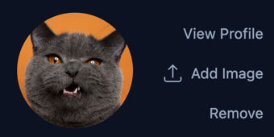 | Clicking the image upload button successfully opens the file manager window that will allow the user to choose an image to upload. Clicking the form button successfully uploads the image to Cloudinary, where it is stored. | Pass |

As a **user**, I can **update my profile** image so that my **profile stays fresh**. -> Completed

|                         Image                         |                       Acceptance Criteria                       |                       Result                      |
| :----------------------------------------------------: | :-------------------------------------------------: | :-------------------------------------------------: |
|  | Clicking the image upload button successfully opens the file manager window that will allow the user to choose an image to upload. Clicking the form button successfully uploads the image to Cloudinary, where it is stored and the old image is deleted. | Pass |

As a **user**, I can **delete my profile image** so that I am **in control of my picture**. -> Completed

|                         Image                         |                       Acceptance Criteria                       |                       Result                       |
| :----------------------------------------------------: | :-------------------------------------------------: | :-------------------------------------------------: |
|  | Clicking the remove button will successfully remove the image from Cloudinary, where it is stored and saves the image field in the backend as blank. | Pass |

As a **user**, I can **add links** of importance to my profile so that other users can get **to know me better**. -> Completed

|                         Image                         |                       Acceptance Criteria                       |                       Result                      |
| :----------------------------------------------------: | :-------------------------------------------------: | :-------------------------------------------------: |
| 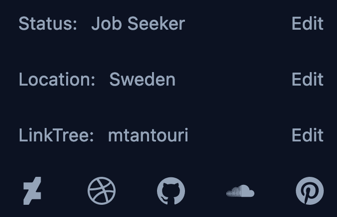 | Clicking on any one of the social media buttons works as expected and opens an input field to allow the user to input their information. | Pass |

As a **user**, I can **update links** on my profile so that **links stay updated**. -> Completed

|                         Image                         |                       Acceptance Criteria                       |                       Result                      |
| :----------------------------------------------------: | :-------------------------------------------------: | :-------------------------------------------------: |
|  | All links can be updated by changing it's input and submitting the form again. | Pass |

As a **user**, I can **delete links** on my profile to **remove outdated links**. -> Completed

|                         Image                         |                       Acceptance Criteria                       |                       Result                      |
| :----------------------------------------------------: | :-------------------------------------------------: | :-------------------------------------------------: |
|  | All links can be removed by removing it's input and submitting the form again. | Pass |

As a **user**, I can **add diverse info** about myself to **build trust with other users**. -> Completed

|                         Image                         |                       Acceptance Criteria                       |                       Result                       |
| :----------------------------------------------------: | :-------------------------------------------------: | :-------------------------------------------------: |
|  | The user can add status, social media, location, and link tree info. All inputs and buttons work as expected after serious tests. Clicking any button does what it is supposed to do, and clicking anywhere else and returning to click on the button again does its job successfully. | Pass |

As a **user**, I can **update my information** about myself to **stay current**. -> Completed

|                         Image                         |                       Acceptance Criteria                       |                       Result                      |
| :----------------------------------------------------: | :-------------------------------------------------: | :-------------------------------------------------: |
| 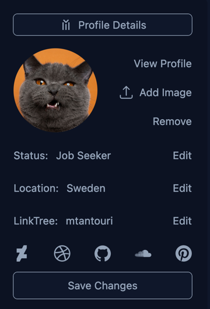 | The user can update any information entered by changing it's input to a new input value. | Pass |

As a **user**, I can **set my current professional status** so that other users can know **if I'm available to collaborate**. -> Completed

|                         Image                         |                       Acceptance Criteria                       |                       Result                      |
| :----------------------------------------------------: | :-------------------------------------------------: | :-------------------------------------------------: |
| 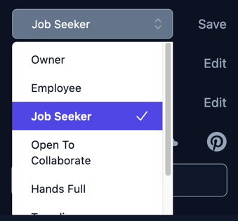 | At any point in time a user can update the profile status to any of the available choices. | Pass |

As a **user**, I can **remove my professional status** from my profile to **keep my privacy**. -> Completed

|                         Image                         |                       Acceptance Criteria                       |                       Result                      |
| :----------------------------------------------------: | :-------------------------------------------------: | :-------------------------------------------------: |
| 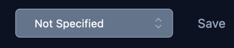 | A user can choose from a variety of choices, one of which is the "not specified" choice. | Pass |

As a **user**, I have my **activities** displayed on my profile for the world to see for **trust building**. -> Not Completed

As a **user**, I can **control which activities** are visible to the world so that I am in **control of my privacy**. -> Not Completed

As a **user**, I can **add work**, **portfolios**, **awards**, and **certificates** to my profile so the world can see **what I have accomplished**. -> Completed

|                         Image                         |                       Acceptance Criteria                       |                       Result                       |
| :----------------------------------------------------: | :-------------------------------------------------: | :-------------------------------------------------: |
|  | The user can successfully add, a post, portfolio, award, certification, and creative. | Pass |

As a **user**, I can **add, edit, update** and **delete** my info to control what **is on my profile**. -> Completed

|                         Image                         |                       Acceptance Criteria                       |                       Result                       |
| :----------------------------------------------------: | :-------------------------------------------------: | :-------------------------------------------------: |
| 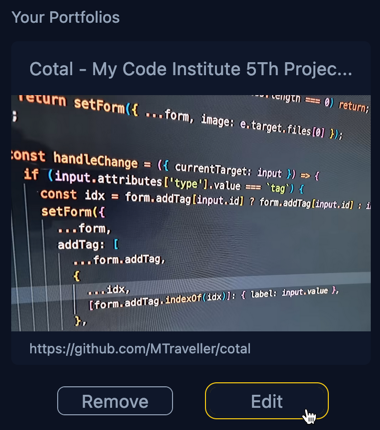 | The user can successfully remove, and edit a post, portfolio, award, certification, and creative. Before a user can delete a post, they must confirm their choice by clicking the remove button twice. Clicking it once and then clicking anywhere else will reset the button. | Pass |

Epic 2

As a **user**, I can **connect with other users** so that I **mingle with other users**. -> Not Completed

As a **user**, I can **disconnect with previously connected users** so that **only those I like are connected**. -> Not Completed

Epic 3

As a **user**, I can **follow** topics of choice to **keep me updated**. -> Not Completed

As a **user**, I can **unfollow** previously followed topics to **keep my feed clean**. -> Not Completed

As a **user**, I can **follow** users to stay **informed with other users**. -> Not Completed

As a **user**, I can **unfollow** users I have previously followed to **keep my feed clean**. -> Not Completed

Epic 4

As a **user**, I can **add posts** to the app so that I might **tell the world a story or two**. -> Completed

|                         Image                         |                       Acceptance Criteria                       |                       Result                       |
| :----------------------------------------------------: | :-------------------------------------------------: | :-------------------------------------------------: |
| 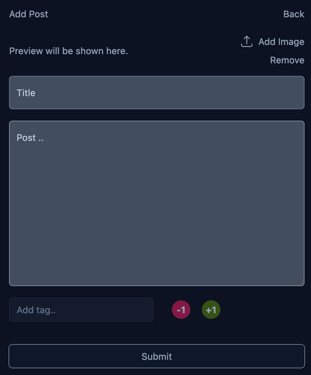 | Posts function similarly to the previous examples, but they can be tagged. Each individual tag input is separate from all others and has its own state, regardless of how many are present at any given time. | Pass |

As a **user**, I can **mention other users** in my posts to **initialize a potential discussion**. -> Not Completed

As a **user**, I can **comment on posts** so that I can **socialize with other users**. -> Completed

|                         Image                         |                       Acceptance Criteria                       |                       Result                       |
| :----------------------------------------------------: | :-------------------------------------------------: | :-------------------------------------------------: |
| 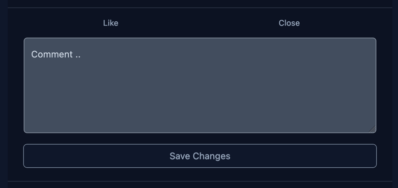 | Users can successfully comment on each other's posts and on their own posts to have a conversation with other users. The comment form is hidden by default. When the user clicks the comment button, the form opens. | Pass |

As a **user**, I can **reply to other users' comments** so that the social aspect of the **app becomes enjoyable**. -> Not Completed

As a **user**, I can **mention other users in my comments** so that it is clear **to whom I am writing**. -> Not Completed

Epic 5

As a **user**, I can **easily navigate** through the app so that **the experience is straightforward**. -> Completed

|                         Image                         |                       Acceptance Criteria                       |                       Result                       |
| :----------------------------------------------------: | :-------------------------------------------------: | :-------------------------------------------------: |
| 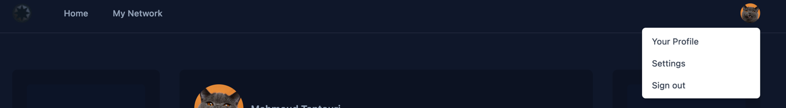 | The navigation is easy to use and is straightforward and to the point. On desktop a user menu is opened by clicking the profile image at the top right of the window. | Pass |
| 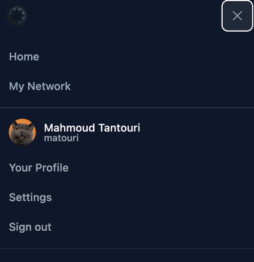 | The navigation is easy to use and is straightforward and to the point. On mobile, the navigation is hidden and a hamburger icon is shown; clicking it will open the menu. | Pass |

As a **user**, I can **easily navigate** to topics of interest so that **my app experience is elevated**. -> Not Completed

As a **user**, I can **search the app** for content that is relevant to my search query so that **I may discover new things**. -> Not Completed

Epic 6

As the **owner**, I want the **posts to be one of the visible features** to the outside world so that **risks for bad actors are minimized**. -> Completed

|                         Image                         |                       Acceptance Criteria                       |                       Result                       |
| :----------------------------------------------------: | :-------------------------------------------------: | :-------------------------------------------------: |
| 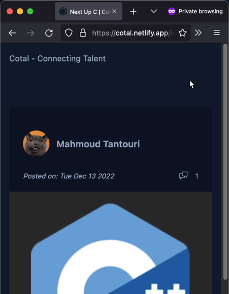 | Posts and content in general are visible to both logged in and non logged in users. | Pass |
| 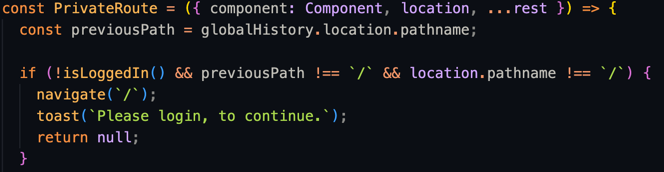 | Private routes are protected by checking if the visitor is logged in. Redirection is in place to redirect the user where appropriate. | Pass |

As the **owner**, I want the **user** profile to be one of the visible features** to the outside world so that **risks for bad actors are minimized\*\*. -> Completed

|                         Image                         |                       Acceptance Criteria                       |                       Result                       |
| :----------------------------------------------------: | :-------------------------------------------------: | :-------------------------------------------------: |
| 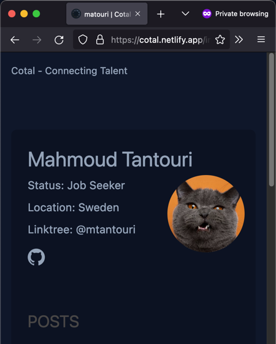 | Profile page is visible to both logged in and non logged in users. | Pass |
| 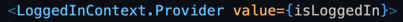 | Security is of the highest priority and is not taken lightly. isLoggedIn is started high up in the virtual tree, and by calling it, it will respond with either true or false. | Pass |

Epic 7

As a **user**, I can **message other users** who are connected with me so that **private communication is available**. -> Not Completed
