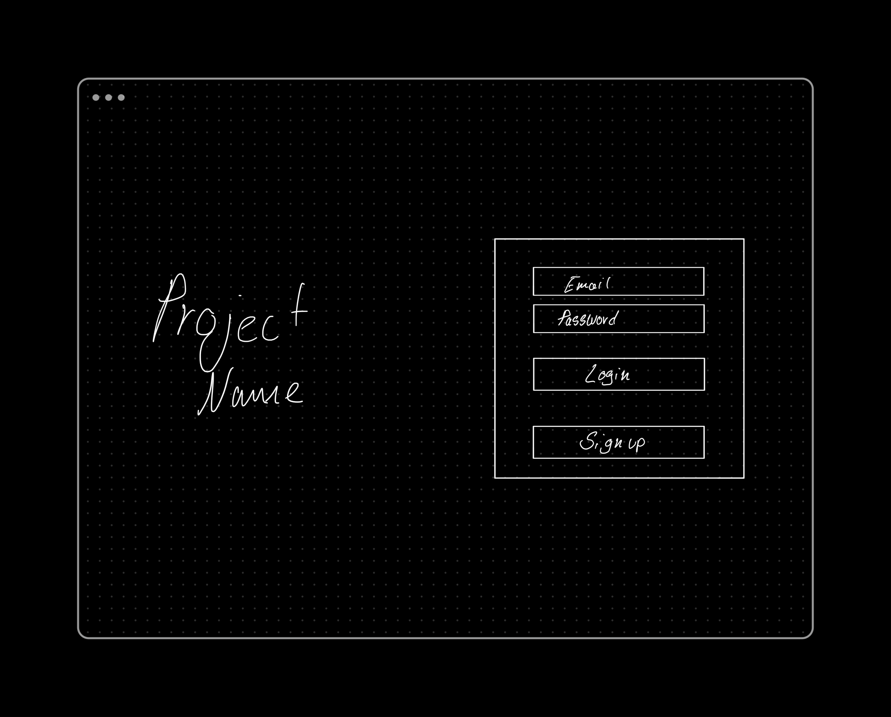
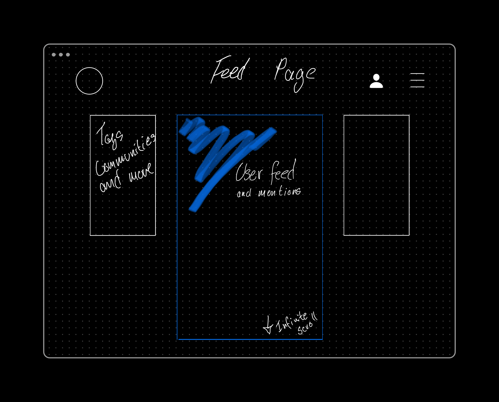
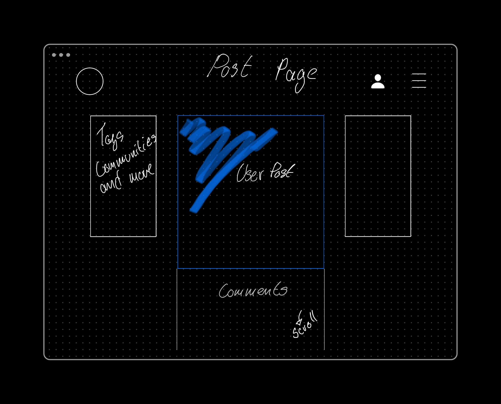
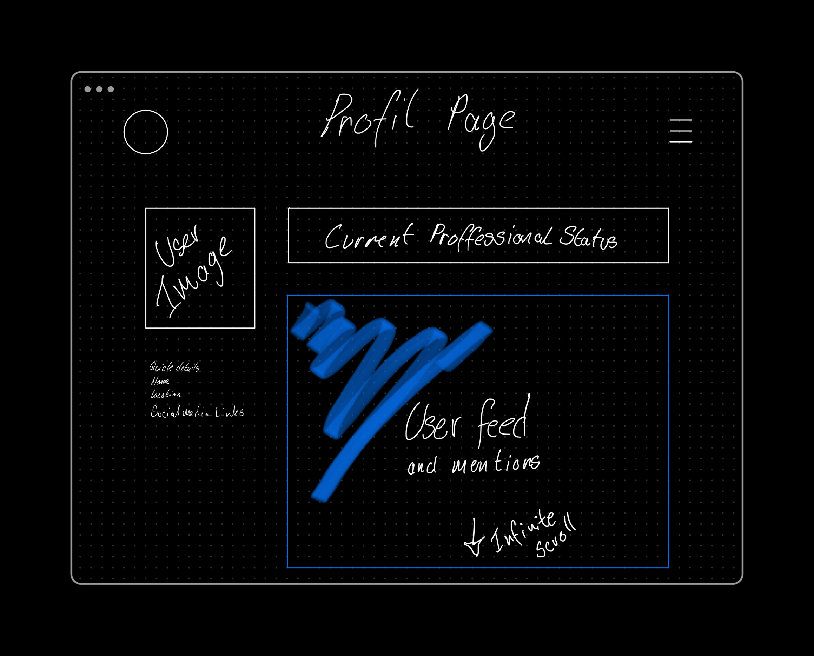
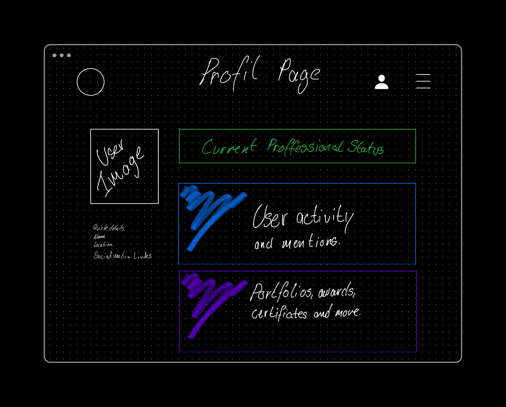
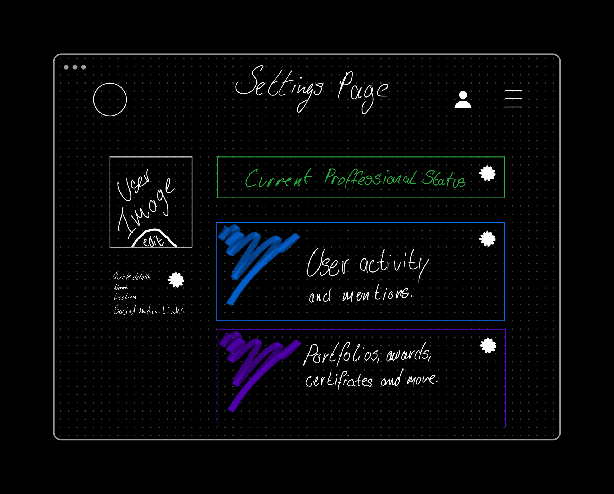
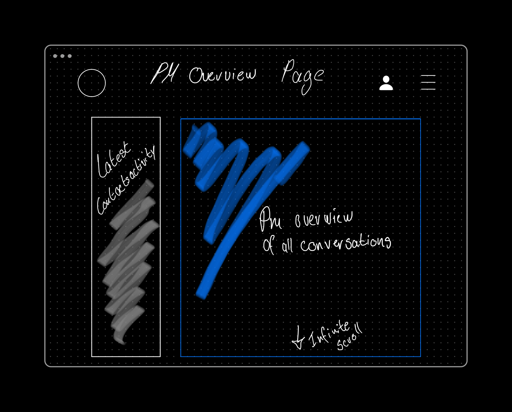
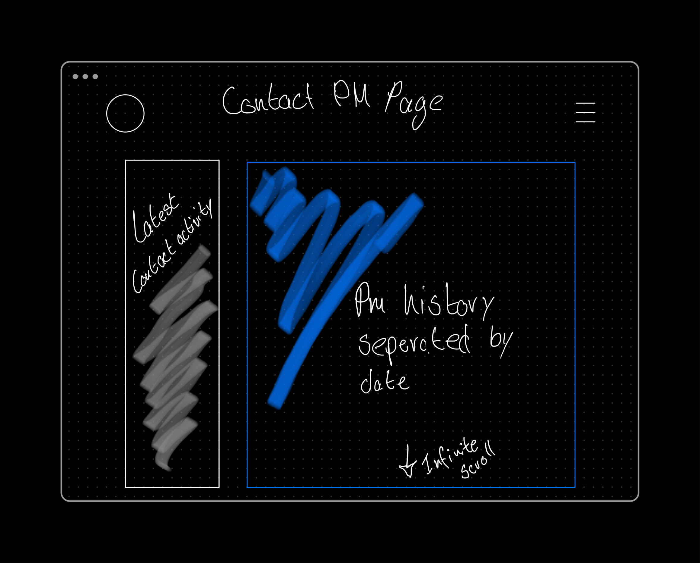
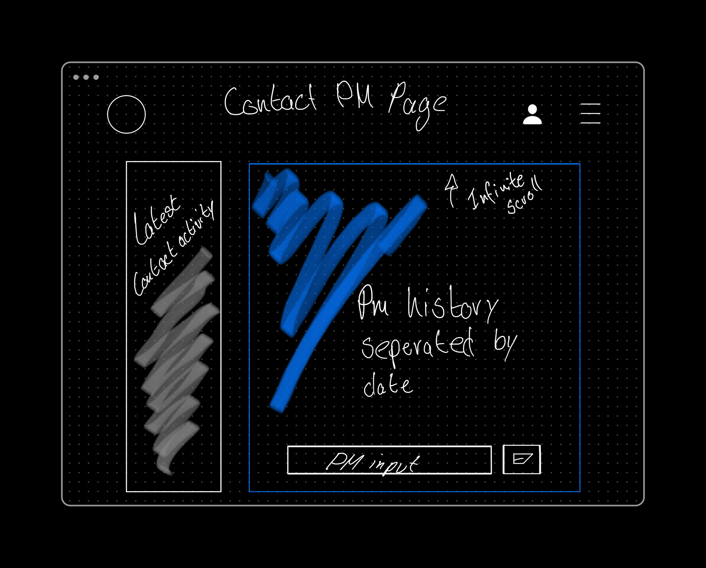

## Wireframes

Not all wireframes were developed, but we included them anyway.

the front page that greets users to login or register.

The feed page populates the newest posts from other users.

User post page based on the slug slugified of the title.

The profile page, which holds the personal details and posts, portfolios, creatives, awards, and certificates

The user account page is where the user can add, edit, and delete content.

The below were planned, but due to the time limit and deadline on the project, I was not able to develop them.

